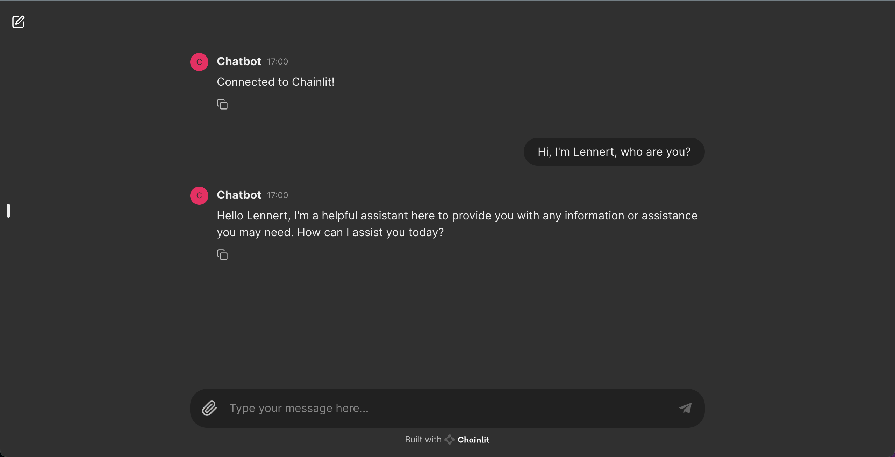
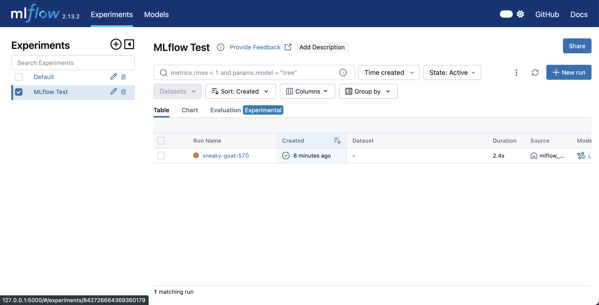
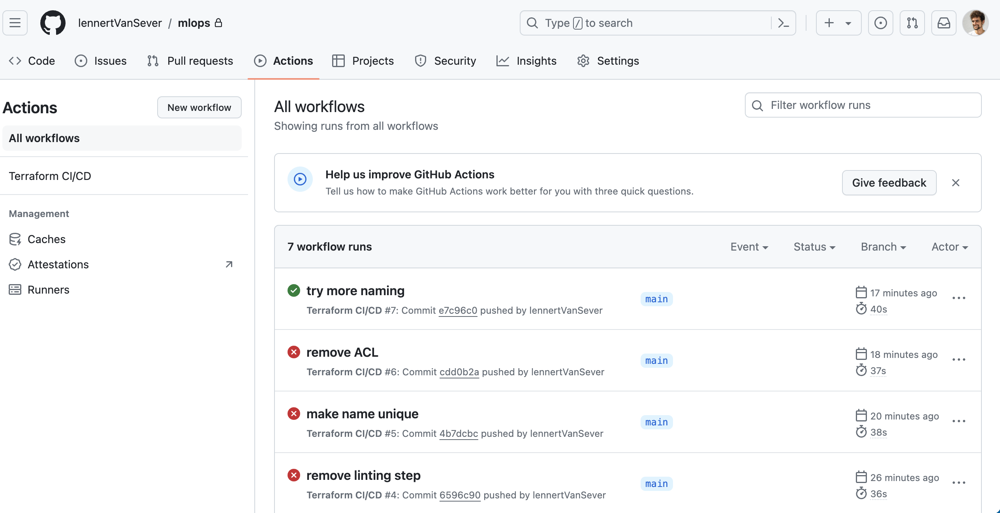
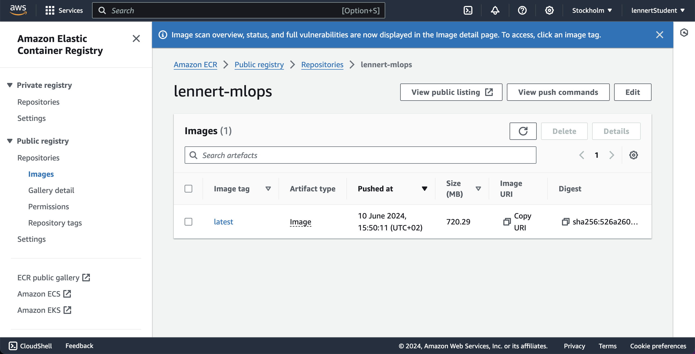

# MLOps by Lennert Van Sever

## Chatbot

I used the cookbook from Chainlit to create a simple Chatbot application.
First add a .env file at the root specifying the `OPENAI_API_KEY`. And now run `chainlit run app/chatbot.py` and then visit http://localhost:8000

## MLflow

First run `mlflow server` and then `python mlfow_tracking.py`. Now visit http://127.0.0.1:5000/ and you should see 'MLflow test' as an experiment

## Docker

I created a docker image following the guidelines, you can see it in the [Dockerfile](./Dockerfile)

## Terraform & Github Actions

I was able to the CI/CD setup by using terraform and Github actions. You can find it in the [infra folder](./infra/) and the [Github action folder](.github/workflows/terraform.yml). It took me some time to get run succesfully run but at the end [I was able to do it](https://github.com/lennertVanSever/mlops/actions). No API Key is plain text inside of the code, it's all inside GitHub secrets.

## AWS

I was able to get the ECR working as described in the course 

